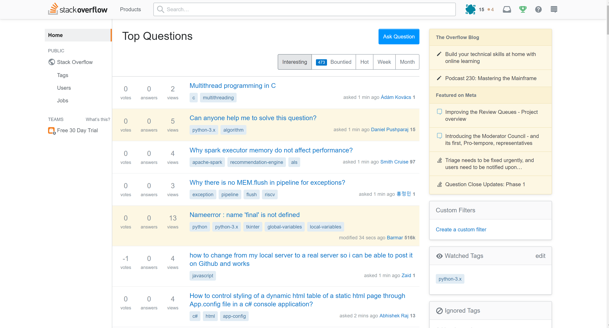
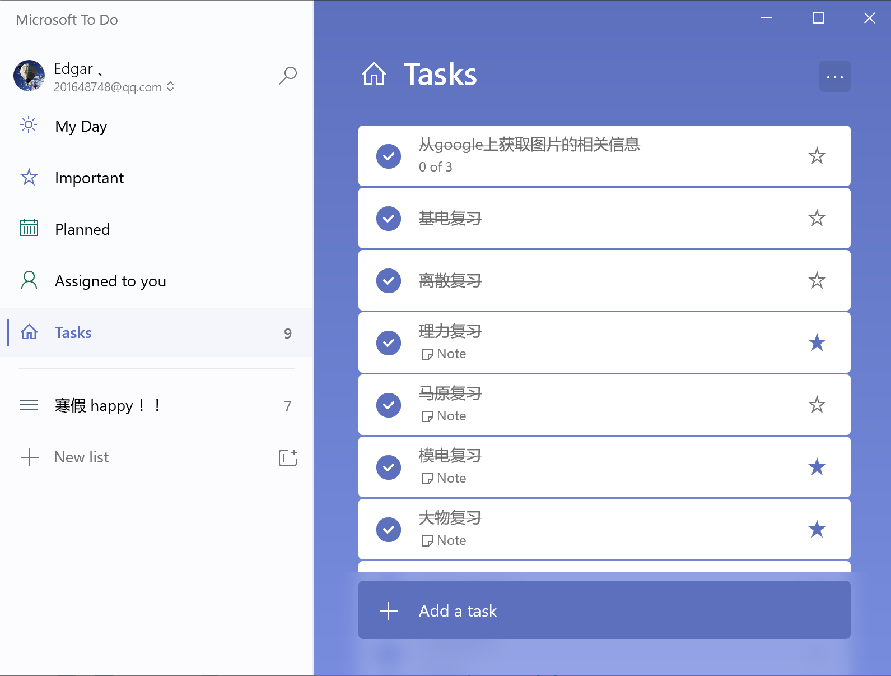

### 从大一到无限期

> 想要自学，那么我推荐你看看这些

<h3>技术学习篇</h3>

#### 1. [Bilibili]( https://www.bilibili.com/ )

> B站用的好，就像获得宝

从前，我以为B站只是个看番，追剧，看鬼畜的网站，直到我发现了它上面的学习资料，B站上面真的有好多好多学习的视频资料，比如

想入门，又不想看文档，B站绝对是你的第一选择，`推荐关闭弹幕食用，毕竟B站弹幕鬼才太多了`

#### 2. [菜鸟教程]( https://www.runoob.com/ )

> 实不相瞒，这个教程的名称还是挺适合我的

菜鸟教程上涵盖了很多很多的编程的`基础教程`， 比如：

菜鸟教程上面包括了主流的编程语言和很多的相关技术，~~假设一下你能够把它统统学完， 不知道可以装多少逼~~

#### 3. [ W3school]( https://www.w3school.com.cn/ )

> 一个专注于网站建设的教程网站

如果你想要搭建网站，那么就选它吧，毕竟人家专注Web技术

#### 4. [W3cschool]( https://www.w3cschool.cn/ )

> 我没有重复哦，这个网站就是这样的

上面有可多教程了，不妨在上面进行参考

#### 5. [Web开发技术]( https://developer.mozilla.org/zh-CN/docs/Web )

> 一个 由Mozilla 贡献者 负责的前端开发手册

#### 6. [ 中国大学Mooc ]( https://www.icourse163.org/ )

> 慕课上面有很多精品课程，毕竟是很多一流老师教授的，值得一听

类似的课程网站还有[网易公开课]( https://open.163.com/ ), [网易云课堂]( https://study.163.com/ )，[慕课网]( https://www.imooc.com/ )，[我要自学网]( https://www.51zxw.net/ )，[简单教程]( https://www.twle.cn/ )， [Coursera]( https://www.coursera.org/)，[TED]( https://www.ted.com/ )

<h3>资源获取篇</h3>

#### 1. [鸠摩搜索]( https://www.jiumodiary.com/ )

想要电子资源，不妨到上面搜一搜，说不定有你想要的电子书

#### 2. [冰点文库下载器]( http://www.bingdian001.com/?p=30 )

看到百度文库上面有自己想要的文件？不妨使用该软件进行下载，输入网站地址，然后开始等待吧

<h3>文档阅读篇</h3>

> 当然很多知识还是阅读官方文档好一点，毕竟不是其他的资源能够跟上文档的更新步伐

#### 1. [Spring]( https://spring.io/ )

搭建企业级Web网页，看看这里吧，虽然是英文版，~~但是界面好看啊~~

#### 2. [Django]( https://djangoproject.com/ )

想要快速开发网站，试试django吧

#### 3. [Flask]( https://flask.palletsprojects.com/en/1.1.x/ )

当然开发小型网站，你也可以看看Flask

#### 4. [Vue]( https://cn.vuejs.org/ )

尝试前后端分离，来来来，看看Vue，现在生态已经很完整了，而且学起来还是挺有趣的

另外推荐几个相关文档 

- [Vue CLi]( https://cli.vuejs.org/zh/guide/ )   一个基于 Vue.js 进行快速开发的完整系统 

- [Vuex]( https://vuex.vuejs.org/zh/ )   专为 Vue.js 应用程序开发的状态管理模式 
- [Vue Router]( https://router.vuejs.org/zh/ )   Vue.js官方的路由管理器 

想要美化，那就试试相关UI组件

- [Element]( https://element.eleme.cn/#/zh-CN )    基于 Vue 2.0 的桌面端组件库 
- [Ant Design of Vue]( https://antdv.com/docs/vue/introduce-cn/ )  Ant Design 的 Vue 实现，开发和服务于企业级后台产品

<h3>分享交流篇</h3>

#### 1. [Stackoverflow]( https://stackoverflow.com/ )

什么，你还有问题不会的，赶快到StackOverflow上提交你的问题！

#### 2. [CSDN]( https://www.csdn.net/ )

作为中国最大的技术交流社区，也不会盖的，在这里，你可以阅读优秀的博文，当然也可以分享你的技术

#### 2. [掘金]( https://juejin.im/timeline )

 一个帮助开发者成长的社区 ， 功能类似于CSDN

#### 3. [简书]( https://www.jianshu.com/ )

在这里，也有活跃的技术人员，但是似乎它的中心似乎不是技术，而是生活，所以截图并没有给出详细的文章 :)

<h3>开源篇</h3>

#### 1. [Github]( https://github.com/ )

世界上最大的开源社区，上面有很多优秀的开源项目，建议食用

#### 2. [Gitee]( https://gitee.com/ )

  OSCHINA.NET 推出的代码托管平台 , 国人自己的开源社区

<h3>实用篇</h3>

#### 1. [Gitbook]( https://www.gitbook.com/ )

如何优美的在线记录自己的技术文章呢，gitbook是你的不二选择，支持markdown等语言哦，~~况且界面这么漂亮美观~~

#### 2. [Mdnice]( https://mdnice.com/ )

每个人都有一个技术梦，万一你要发公众号文章呢，不想要浪费时间排版？想要一键markdown语言转化成文章？还想要自定义主题？顺便导出个PDF？好了，那么就选择mdnice吧

#### 3.[Postwoman]( https://postwoman.io/ )

想要测试后端接口，来试试这个

#### 4. [Postman]( https://www.postman.com/ )

什么，你说你是man，不想要用woman的东西？好，那用postman吧

#### 5. [Ghelper]( http://googlehelper.net/ )

什么，你说你想要访问Google，但是没有梯子，那我就推荐一个不要梯子也可以访问Google的扩展！如果有童鞋不能够访问这个网站，可以试试我的github上的哦 [传送门](https://git.io/JfmUE)

#### 6. [SwitchyOmega]( https://chrome.google.com/webstore/detail/proxy-switchyomega/padekgcemlokbadohgkifijomclgjgif )

你说你有很多的代理，不知道怎么方便的进行设置，并且切换？ 好，那么SwitchyOmega很适合你哦

#### 7. [GitZip for github]( https://chrome.google.com/webstore/detail/gitzip-for-github/ffabmkklhbepgcgfonabamgnfafbdlkn )

什么，你说在github上下载别人项目的时候不想全部下载，只想下载其中的某一部分？那么好吧，试试推荐的这款插件，`双击需要下载的文件夹或者文件commit信息后的空白处，点击右下角的箭头即可轻松下载`，包你满意，~~不满意也不支持退款~~

#### 9.  [Nimbus Screenshot & Screen Video Recorder ]( https://nimbusweb.me/screenshot.php  )

网页想进行长截图，但是不知道怎么办？ 试试这款推荐的插件

#### 10. [Microsoft To do]( https://todo.microsoft.com/ )

想要给自己指定计划？而且还要好看的软件，好了，试试这款软件吧，个人体验还是挺棒的

#### 11. Terminal

> 应用商店搜索即可下载

Windows下的终端，Mac用户可忽略，支持定制

#### 12. [Xmind ]( https://www.xmind.cn/ )

制作美观的思维导图？那你不能没有它

#### 13. [Everything]( https://www.voidtools.com/ )

Windows 自带的搜索太慢了？让Everything来做吧

#### 14. [ScreenToGif]( https://www.screentogif.com/ )

想要制作一个gif动图？ 墙裂推荐这个软件！！ 轻便又强大

#### 15. [Typora]( https://www.typora.io/ )

轻巧美观的markdown编辑器，而且支持Latex公式！

<h3>刷题篇</h3>

#### 1. [力扣]( https://leetcode-cn.com/ )

想要刷题的童鞋可以到这里刷刷，题目后面还有官方解答和社区的解答哦

#### 2. [牛客网]( https://www.nowcoder.com/ )

一看就知道是很多牛人在一起的地方，这里有丰富的面试题，笔试题，要找工作了，快去看看

<h3>软件篇</h3>

#### 1.[pycharm]( https://www.jetbrains.com/pycharm )

想要用python进行大型的项目编程，那么pycharm当然是最好的IDE了，不接受反驳

  

#### 2. [IDEA]( https://www.jetbrains.com/idea/ )

如果要使用Java进行编程，那么我还是推荐IDEA

#### 3. [Vscode ]( https://code.visualstudio.com/ )

这么好看好用的软件，当然要狠狠的推荐一波，支持多种语言, 比如c++，c，python，html，css，js等等等，但需要自己进行配置

#### 4. [Visual Studio]( https://visualstudio.microsoft.com/vs/ )

如果使用C语言或者C++，这款软件还是挺棒的，当然你还可以用jet brain的[ CLion ]( https://www.jetbrains.com/clion/ )

#### 5. 其他

啥，你学的语言不在这些个里面，那我推荐你到[jetbrains全家桶]( https://www.jetbrains.com/products.html )里看看

持续进行更新ing！

